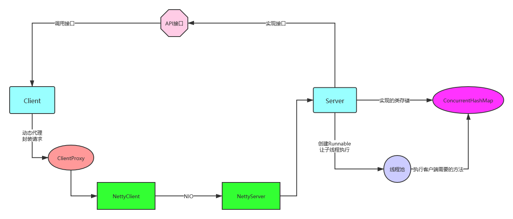
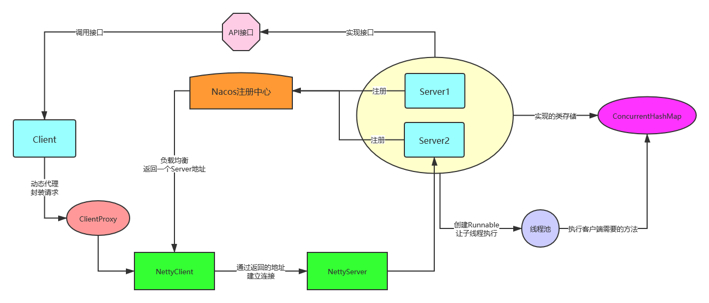

# My-RpcFrameWork

为了提升自己对于RPC框架的理解，所以打算手动实现一个类似Dubbo一样的RPC框架。

RPC框架实现的主要功能有：

- 注册中心：负责服务的注册和查找，客户端可以直接通过查找注册中心里面注册的服务地址列表，然后进行访问，避免在客户端中写IP地址+端口号，同时也可以防止单一服务器挂掉后无法继续提供服务。
- 通信协议：规定了远程调用时发出的请求，比如可以使用基于BIO的Java原生的Socket编程或者是基于NIO的Netty。
- 序列化：在传输过程中需要对request 和 response进行序列化和反序列化。
- 动态代理：通过动态代理，对客户端发起的请求进行填充，如创建request对象并赋必要的信息(类名、方法名、参数类型、参数值.......)。
- 负载均衡：避免单一的服务器无法承受太大并发访问量，通过负载均衡来选择请求到哪一台服务器上，减轻服务器的压力。
- 反射：通过反射来运行客户端想要调用的方法
- ......

## 版本1

第一次实现的时候就是模拟一下远程调用的过程，具体实现如下：

- 注册中心：ConcurrentHashMap来实现一个注册表，存储在本地
- 通信协议：直接使用Socket来传输数据，将RpcRequest 和 RpcResponse分别封装成两个类来传输
- 动态代理：在客户端调用时，通过动态代理的方式来创建RpcRequest对象并填充值，这样客户端调用会十分简便
- 序列化：通过JDK序列化完成传输过程中，对RpcRequest 和 RpcResponse进行序列化和反序列化
- 反射：通过反射来调用实际的方法

- 线程池：避免因为调用方法时导致ServerSocket阻塞，在这里通过创建子线程来异步调用客户端需要的方法

## 版本2

第二次迭代的时候，整合了Netty和Kryo序列化工具。通过Netty替换Java原生的Socket编程，由原来的BIO变为NIO，效率进一步提高；Kryo替换JDK序列化，Kryo的特点就是性能高、便于使用，它是基于字节的序列化，对空间的利用率更高，减轻网络传输的负担。

- 通信协议：Java原生的Socket —> Netty
- 序列化：JDK序列化 —> Kryo

## 版本3

第三次迭代的时候，整合了Nacos注册中心和负载均衡。通过Nacos注册中心实现了客户端可以不用在手写IP地址和端口号。只需在NettyClient中获取Nacos保存的注册地址即可；实现负载均衡，避免大量请求到同一个服务器，导致服务器宕机。

- 注册中心：Nacos
- 负载均衡：轮询法、随机法

